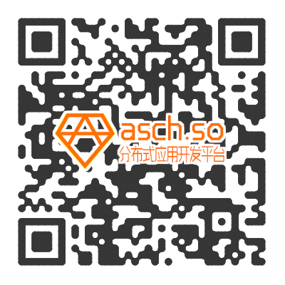
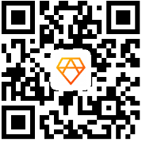

title: Asch FAQ
---

# 1 The brief introduction of Asch

The original design purpose of Asch is to reduce the skill threshold for the developers.For example,
it makes DAPP development and traditional web applications become quite similar by adopting JavaScript
as an application development language and supporting RDB (Relational Database) to store the transaction data,
which must be extremely attractive to developers and SMEs (Small and Medium-sized Enterprises).We believe the
ecosystem of the whole platform will not be developed rapidly unless developers’ productivity could be promoted.
Asch is also an open platform which is not limited to a particular area, such as finance, document storage,
copyright proof etc, but providing a series of underlying and abstract APIs which can be combined freely to realize
various kinds of application. In addition, Asch system inherits and  enhances DPOS(Delegated Proof of Stake) algorithm
in its consensus mechanism to significantly reduce the probability of block fork and the risk of duplicate payment.
Most importantly, Asch’s sidechain-is-application mode can not only alleviate the blockchain inflation issue, but also
make DApp more flexible and characteristic. Asch is a prospective, low-cost, one-stop solution that is surely able to
be the incubator of next generation decentralized application. The token of Asch is XAS, and the initial amount of
XAS is 100 million. See Asch official website for details.

# 2 How do we know Asch?

check [official website](https://www.asch.so/)
Read [Asch white paper](https://www.asch.so/asch-whitepaper.pdf)
Developers can view/check the source code of Asch from github website and communicate with people through Asch official QQ groups[Asch的github](https://github.com/AschPlatform/asch)

Asch official ecological community QQ group one：485979564
Asch official ecological community QQ group two：545183438
Asch developers QQ group：472708713
BIVIEWS: ASCH  Column
Micbolg: 北京阿希链科技有限公司
Official WeChat：

# 3 What is the Asch Wallet?

Please be sure to back up the master password of wallet when you use your Asch wallet. If forget your master password,
you will never open your wallet. When you input master password, please note the space to avoid getting different
wallet address.

Old wallet address of Asch system is digital, later upgraded to letters.  Both can be compatible, but some exchanges
can not be compatible. So old users should  pay  attention to exchange currency to use new wallet letters address as
far as possible.

Online wallet: http://mainnet.asch.so/

How do we use wallet?

Freshman must see how to manipulate Asch account proficiently.
[Notes for wallet users](http://bbs.asch.so/topic/23/%E9%92%B1%E5%8C%85%E7%94%A8%E6%88%B7%E9%A1%BB%E7%9F%A5)

Local Wallet（全节点钱包）

If you want to install Local Wallet by yourself, please refer to this document [Asch Node Installation Guide](https://github.com/AschPlatform/asch-docs/blob/master/asch_install.md).

Mobile Wallet

Mobile wallet only needs to enter a master password when login to mobile wallet. Then set the gesture password. After that, using the gesture password can access the wallet.

android钱包
    
ios钱包
    

# 4 What language is used to develop Asch?

Asch platform is developed by Node.js language. There are some underlying developed modules with C or C++ language.
If there are bottlenecks in performance, you can use C or C ++ to modularize it at all.

If you want to develop Asch platform itself, Node.js is the necessary skill, follow-up to add  SDK of mainstream
development language like java, python, php, Go etc.

# 5 What frameworks does Asch use?

Asch itself is a framework that is easy for users to develop Dapp of blockchain-level. Because it is developed by Node.
Js, some existing modules are using, such as express.

# 6 What features does Asch have?

1. Support side-chain (cross-chain). Store Dapp data in the side-chain, and then the main chain data will not swell too fast.
2. Advantages of Node.JS language.
3. Storage block data of relational database to reduce the difficulty of Dapp development
4. The speed of block production is fast. Produce a block in every 10 seconds and confirm it fast.
5. There will be no bifurcation.
6. Safe sandbox isolation mechanism

# 7 Why will Asch not bifurcate?

Asch system uses consensus which is based on DPOS,the delegate election system,but on the bottom half of the algorithm
we use a optimized and variant PBFT algorithm.This algorithm can achieve the consistency of the loyal nodes by the time
complexity of O(n ^ 2) and message complexity of O(1) at t<n/3 to prevent bifurcation,in the equation t presents the
number of the Byzantine Failures nodes(any possible problems like network latency,system crash,vicious attack and so on),
n presents the number of all nodes.

# 8 Can Asch be mined?

Asch uses a non-Pow algorithm, so it can not be mined. But it can be used to obtain the benefit forging by delegators.

Asch use AC1.0 consensus algorithm(a optimized dpos with pbft algorithm),ensure the output of blocks through the delegate system.

Everyone can register to be a delegate,everyone can vote for any delegate,but only the top 101 delegates who get the
most votes can forge blocks(accounting).Now delegate can get 3.5 XAS as reward for forging one block,and each block
takes 10 seconds to be forged.

# 9 How many are the initial circulations of Asch?

Asch's initial circulation is 100 million. For details, see the Asch ICO scheme.

# 10 How much is Asch trustees’s returns?

Gross profit per day: 24*60*60/10*3.5=30240 XAS

Each trustee’s gross profit per day: 30240/101=299.4 XAS

The block rewards will decrease over time.Please click to see the details.

# 11 How do we issue our own assets by Asch?

[Click to see the publishing asset tutorial](http://bbs.asch.so/topic/115/asch%E5%8F%91%E8%A1%8C%E8%B5%84%E4%BA%A7%E4%BD%BF%E7%94%A8%E6%96%87%E6%A1%A3)

# 12 Which platforms does Asch support?

Currently, only the Linux platform is fully supported, while Windows can synchronize blocks but cannot produce blocks.
And other platforms will support later.

# 13 Comparision among Asch, ETH and LISK

Comparision between Asch and ETH

|name|ASCH|ETH|
|-----|------|-------|
|Consensus mechanism|DPOS+PBFT Compared to pow,DPOS and PBFT focuses more on decentration. Pow has the problem of calculating force or centralization of miners. Compared with pos,pow’s right to keep accounts is transferred to the trustees, but the shareholders still have the decision-making right, more security and decentralization.|Pow+pos|
|Smart contract implementation|side-chain. The data is in dapp.|Transaction scripts.  The data is all in the main chain, easily expanding.|
|Contract language|Native javascript|Solidity is operated on evm.ETH lacks of documents,with little appropriate users and high threshold.|
|expansibility|The application of side chain and side chain can be downloaded as users needs without causing the main chain expansion.|The surge of Dapp will pose risks to the whole blockchain.|
|security|The side chain operates independently ,without affecting the main chain.|The Dapp vulnerability will affect the whole blockchain, such as the dao event.|
|confirmation time of block|10s|15s|
|TPS|3000|20|

Comparision between Asch and LISK

|name|ASCH|LISK|
|-----|------|-------|
|Consensus mechanism|DPOS+PBFT There is not fork and double-payment risk attacked by hackers.|DPOS,furcation and fixture block.|
|sandbox|Real sandbox can limit side chain’s permissions.|ETH cannot restrict the side chain’s permission.|
|Non-critical refinement and optimization |1.Create and sign the transaction at the front and transfer the encrypted data to the back.2.As long as the problem of front-end performance is solved,it will not cause dpos to system itself.3.As data persistence, the savepoint of databaseand the rollback is widely adopted. Although in poor network conditions, it won’t fix blocks and furcate.|The user's password is transmitted directly to the back-end, which is easy to record and access.|
|TPS|3000|20|

# 14 Where can Asch trade?

Now
[Yuanbao](https://www.yuanbao.com/trade/xas2cny)
[Jubi](https://www.jubi.com/coin/xas/)
[Bijiaosuo](https://www.biduobao.com/market-xas.html)
[Biduobao](https://www.coinvc.com/market/trade/xas)
[cryptodao](https://cryptodao.com/)

future
[Duoyuan](https://www.dyszsp.com/)
[BTC100](https://www.btc100.cn/)

# 15 What blockchain browzers does Asch have?
Chinese version：http://aschd.org/
English version：http://explorer.asch.pub/

# 16 What Api does Asch provide?
The form of Api for Asch is restfull,if you request  like http://45.32.248.33:4096/api/transactions/get?id=08ce16c9cf6a0dd4636f8f17665146984293c2f2889124877ad7e4f3eea37eb2，Then return to the json data.。
There are three type of API :
1. General external access Api
2. Internal communication Api
3、dapp api

# 17 What is the Asch inflation rate?
The block bonus  will decline by the time,the specific time is based on the height of a block in the future. The block bonus  system starts form 464500, with an initial reward of 3.5 coins, and is reduced every 3 million blocks  in 1 years. After the 15464500 block, bonuses are no longer diminishing, with a slight inflation rate of less than 1.5% a year (relative to the initial amount of 100 million).
The  inflation rate is as follow： (calculated from the 464500 block, because there are block rewards at this time, probably around October 7, 2016)

|Years|inflation rate relieve to last year|Current block bonus sum(ten thousandXAS)|
|-----|------|-------|
|First year|10.5%|1050|
|Secend year|7.5%|900|
|Third year|5.9%|750|
|Fouth year|4.5%|600|
|Fifth year|2.2%|300|
|Sixth year|1.1%|150|

Here are the blocks of rewards at all stages:

| Trustee Award(xas) | Start height | End height  |
| ------ | ------ | ------ |
| 3.5 | 464500 | 3464500 |
| 3 | 3464500 | 6464500 |
| 2.5 | 6464500 | 9464500 |
| 2 | 9464500 | 12464500 |
| 1 | 12464500 | 15464500 |
| 0.5 | 15464500 | --|

# 18 What is the GPL of Asch code?

The MIT License (MIT)

# 19 What related algorithms does Asch use?

Consensus algorithm 0.5（AC0.5）
Consensus algorithm 1.0（AC1.0）
Password generation algorithm: BIP39 specification (Level 1 password)
Private key and public key generation algorithm: ed25519 encryption

# 20 Side-chain (cross-chain) Introduction

The side chain refers not to Asch as the side chain of the other block chain, but to the Asch that has its own side chain,Dapp.

Currently only use nodejs development, if you want to use Java, python, PHP and other language development, as long as the corresponding SDK can be done, we can try to write, mainly to Asch-js this library written in other languages.

For convenient to Dapp development, Qingfeng was doing optimization, Asch2.0 will be released.
The existing documents are as follows:
Asch Dapp development introduced: side chain related technical notes.
Dapp development 1: Asch Dapp Hello World: this document will teach you how to create and publish a basic side chain applications, and introduce the source code structure of the side chain framework.
Dapp development 2: Asch, Dapp, Asset
Dapp development 3 : Asch Dapp Mini DAO, and this document teaches you how to create new transaction types or smart contracts, and provides a mini Dao project that includes project management and voting functions as a demonstration
Dapp development 4: Asch Dapp Dice Game development tutorial, this
document teach you how to create more complex types of transactions or intelligent contract, how to establish the association between the contract, how to enforce contracts to rely on historical transaction data, and the realization of a dice game as a demo.
Dapp development 5: release Dapp to the online, this document teaches you how to register on the online system (testnet, mainnet), and how to install and uninstall.

# 21 How do we transfer Asch?

Click : http://forum.asch.so/index.php?s=/forum/index/detail/id/95.html

# 22 Asch’s work focus
There are two main directions: application development and bottom development:
1. Application development :Mainly for several typical applications, such as news aggregate, forecast markets and  exchanges.
2. Bottom development: Optimize TPS, smart contracts, anonymous transactions, the authentication, the Oracle, and the cross links between BTC and  ETH.
3. The community has already developed some supportingfacilities，such as asset browser, USB wallet and Java sdk.

# 23 Asch发展历程

Asch officials have brought the donations to earthquake-stricken area in Sichuan on August 10th, 2017.

Asch community has issued the first DAPP demonstration application, CCTime and its white paper on August 7th,2017.

Qingfeng Shan delivered a speech on side chain technology and the version of block chain 2.5 in Blockchain Geek Summit in China on August 6th , 2017.

Asch has joined Blockchain technical application association in Zhengjiang, becoming a full member of the association on August 3th,  2017 .

Qingfeng Shan, the founder of Asch, was invited to the construction seminar of Blockchain ICO industry ecological system in Guiyang, China on July 25th, 2017 .

Asch has released the version of 1.3.0 on July 18th, 2017.

Asch was traded in YUANBAO Exchange on July 6th, 2017.（yuanbao.com/trade/xas2ybc）

Asch was traded in CRYPTODAO Exchange on July 1th, 2017.（cryptodao.com/site/index/XAS）

On June 20, 2017, XAS was traded in the two exchange platforms, coinvc.com and biduobao.com at the same time.

On June 19, 2017, Asch was first entered into  coinmarketcap.com, and was top 50 in the Global Encryption Coin

On June 5, 2017, Asch mobile wallet for Android and M version was officially released.

On May 14, 2017, Asch participated in the First China Block Chain Developing Competition.

On May 8, 2017, Asch was first entered into coinmarketcap.com, and was top 100 in the Global Encryption Coin.

On April 7, 2017, Shoushan Zhang made a speech about Asch 2.0 (With constant should ten thousand change)  in the Second China Financial Trading Technology Conference.

On March 5, 2017, released Version 1.2.7: Fixed issues submitted by front-end transactions. Fixed pop-up dialog box to show questions. The light purse allowed users to select the node themselves.

On March 1, 2017, Version mainnetnet 1.2 of Asch would be activated officially:
Added storage interface.
Added issuing asset for users interface.
Adjusted (optimized) web graphic interface.
Changed the format of transaction number and block number to 32 hex bytes without the affection of the old data..
Coexisted the old and new data.
Changed the account address to base58check code, and coexisted the old and new account.

On March 1, 2017, released version 1.2.6.

On Feb. 26, 2017, released version 1.2.4 and activated address of base58check format after block 1700000.

On Feb.26, 2017, released version 1.2.3:
Added the simple storage function (customized by Zhongjinyun)
Added fuction of issuing asset for users (UIA)

On Feb. 17, 2017, released version 1.2.2.

On Jan. 18, 2017, release version 1.2.1
Changed the format of transaction number and block number to 32 hex bytes without the affection of the old data.
Changed the account address to base58check code, and coexisted the old and new account

On Dec. 20, 2017,  Green Paper of Asch-eco community was published. After that week, the presidents and vice presidents of the Volunteers Association, the Trustee Association, the Developer Association would be selected.
In Dec. 2016, cooperated with Japanese Telecommunications Company and released digital asset.

On Nov. 25, 2016, Shousong Zhang made a speech about “Block Chain Application based on side chain technology ” in WOT2016 Big Data Technology Summit.

On Nov. 22, 2016, held the training of enterprise block chain technology invited by Japanese Mengzhen company.

On Nov. 10, 2016, released version 1.1.5 and fixed the block problem caused by backwards tick.

In Oct. 2016, cooperated with Beijing Financial Cloud Laboratory, and carried out existing evidence business (customized version of Asch )

In Oct. 2016, XAS was trading in BTCBOX.COM (quit the market of Japan International Exchange )

On Oct. 26, 2016, released version 1.1.4:
Fixed the memory overflow problem caused by request@2.76.0
Used a specific version of the node module as Asch dependencies

On Oct.26, 2016,  released version 1.1.3, and fixed trade ductility issues.

On Oct.21, 2016, released version 1.1.2:
Supported i18n
Dealed with synchronized main card problem caused by transaction rollback.
Fixed the cleaning problem of dapp database.

On Sep. 30, 2016, released version 1.1.1:
Fixed the synchronized bugs  in LAN environment.
Added detection of version compatibility, and refused to accept incompatible connection of node for old version.

In Sep. 2016, XAS token of Asch program was traded in Jubi (（www.jubi.com).

On Sep.15, 2016, released 1.1.0:
Fixed bugs of multiple dapp running at the same time.
Added Page Display of front end dapp.
Added Status Display of block production.
Added commands to start block production in Asch script.
Updated dapp types.
Fixed the crashing bugs for getdelegates in certain conditions.
Fixed bugs in dapp installation and uninstallation.
Added querying interface for top account.
Fixed reindex bugs during restarting which happened in great chance.

On Sep. 8, 2016, released version 1.0.1, light purse was on line officially and fixed unconfirmed transactions.

On Sep. 1, 2016,the source code of  Asch product officially was opened. The source code document: https://github.com/sqfasd/.

On Aug. 16,2016, Asch main net was launched officially. ICO released the token.

On Aug. 11, 2016, Consensus Algorithm was upgraded to AC1.0.

On Aug. 9, 2016, system was upgraded to version 0.9.5 and optimized bandwidth. In the testnet combined by 49 nodes, the peak bandwidth was around 600kbps.

On Aug.3, 2016, released version 0.9.4, the product tended to be stable.

On Aug.2, 2016, released version 0.9.3.

On July 17, 2016, released version 0.9.2.

On July 13, 2016, released version 0.9.1. The beta began to test and trustee began to participate in the test, too.

On June 20, 2016, Announced results of Asch ICO, which raised a total of 1795.60074911 bitcoin and 479407.87 RMB.
At 4:00, June 28, 2016, the first block of Asch was born.
At 23:00, June 26, 2016, Asch ICO ended successfully.
In June 2016, achieved a full version of dpos+pbft algorithm in formal products, and deployed 10 machines to test it.
The result of tests met the expectation in security. The whole system was still not be bifurcation(AC0.5) under the
circumstances like rebooting frequently, broadcasting blocks irregularly, cheating by a small number trustees.
initialized Asch source code library on: git.oschina.net

At 18:00, May 22, 2016, Asch began ICO.
On March 21, published <Bug analyses and solution plans of Lisk sandbox >
In March, analyzed bugs of DPOS algorithm and simulate an attack using this bug in a simple way, then implement a predigest algorithm model based on PBFT to fix this bug(prototype of Asch consensus algorithms). https://github.com/sqfasd/dpos-pbft/
On March 21,2016, announce Asch ICO plans:
    Total amount:100 million XAS tokens
    ICO amount:75 million XAS tokens
    Promoter and promotion reward:2 millon XAS tokens
Early supporter reward:1.5 million XAS tokens
Application developer reward:6.5 million XAS tokens
Post-promotion, operations, cooperation fund:5 million XAS tokens
	Reservation for official team:10 million XAS tokens
	Minimum Goal 1000BTC
	Starting time 18:00 May 22, 2016
	Ending time 23:00 June 26, 2016
	ICO Raising was Supported by two ways: Bitcoin and RMB
In Jan. 2016, Asch program was initiated and started.

