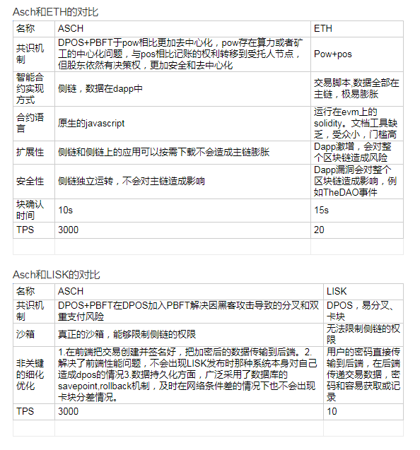

title: Asch问答
---

# 1 请简单介绍下Asch
Asch在模式上类似以太坊，其设计初衷是为了降低开发者的门槛，比如使用javascript作为应用编程语言，
支持关系数据库来存储交易数据，使得开发一个dapp与传统的web应用非常相似，相信这对开发者和中小型
企业有很大的吸引力，只有开发者的生产力提高了，整个平台的生态才能够更迅速的繁荣起来。Asch在设计
上也是开放的，并没有局限于某个细分领域，比如金融、文件存储、版权证明等，其提供的api都是较底层
和抽象的，它们可以被自由组合实现各种不同的应用。在共识机制方面，Asch继承并增强了DPOS算法，大
大降低了分叉几率和双重支付风险。另外，Asch的侧链即应用模式不但延缓了区块链膨胀问题，还使得dapp
更加的灵活和个性化。
Asch是一个具有前瞻性的、低成本的一站式应用解决方案，相信将成为新一代去中心化应用的孵化器.Asch
的代币为XAS，初始总量为1亿。

# 2 我应该样去了解Asch？
查看[官网](https://www.asch.so/)
通读[Asch白皮书](https://www.asch.so/asch-whitepaper.pdf)
如果是开发者，可以通过查看[Asch的github](https://github.com/AschPlatform/asch)，大致了解源码相关内容
去QQ群和大家沟通交流
Asch生态社区1群：485979564
Asch生态社区2群：545183438
Asch开发者协会群：472708713
官方微博：北京阿希链科技有限公司
官方微信公众号：

# 3 Asch钱包有哪些？
使用钱包的时候，注意密码做好备份工作，如有不记得密码的，目前是找不回账户的，使用主密码登陆的时候
注意空格，以免获得不同的钱包地址！！！

Asch系统以前的钱包地址是数字地址，后面升级为字母地址，两者可以兼容，但部分交易所不兼容，所以老用
户要注意交易所提币尽量使用新钱包的字母地址
浏览器钱包：http://mainnet.asch.so/
钱包不会用怎么办？
[小白玩转asch账户必看](http://bbs.asch.so/topic/21/%E5%B0%8F%E7%99%BD%E7%8E%A9%E8%BD%ACasch%E8%B4%A6%E6%88%B7%E5%BF%85%E7%9C%8B)
[钱包用户须知](http://bbs.asch.so/topic/23/%E9%92%B1%E5%8C%85%E7%94%A8%E6%88%B7%E9%A1%BB%E7%9F%A5)

本地钱包（全节点钱包）
需要自行搭建，参考[Asch节点搭建](https://github.com/AschPlatform/asch-docs/blob/master/asch_install.md)这篇文档。

移动端钱包
    移动钱包登陆进入后只需要输入一次主密码，然后设置手势密码，往后登陆使用手势密码即可登陆钱包使用。

android钱包
    
ios钱包
    

# 4 Asch是用什么语言开发的？
Asch平台是用Node.js语言开发的（底层有部分C或者C++开发的模块），如果出现性能瓶颈，完全可以用C或者C++将之模块化。
如果想做Asch平台本身的开发，Node.js则是必备技能，后续增加java、python、php、Go等主流开发语言的SDK。

# 5 Asch使用了哪些框架？
Asch本身就是一个框架，方便用户开发区块链级别的Dapp。由于其本身使用Node.Js开发的，因此使用了一些既有模块，如express。

# 6 Asch有哪些特点？
支持侧链（跨链），Dapp数据存储在侧链，主链数据不会膨胀过快。
Node.JS语言优势
关系型数据库存储区块数据，降低Dapp开发难度
产块速度块，每10秒产一个块，确认快。
不会出现分叉
安全沙箱隔离机制

# 7 Asch为什么不会出现分叉？
Asch 系统采用的共识机制是基于 DPOS 的，也是使用了委托人选举的制度，但是在算法的后半部分采用了一个优化后的 PBFT 算法变种，
这个算法可以在 t < n / 3 时，以O(n^2)消息复杂度，O(1)的时间复杂度使忠诚的节点达成一致，不会分叉，
其中 t 表示拜占庭节点(即可能发生任意行为的节点，比如网络延迟、停机、恶意攻击等等)的个数，n 表示所有节点的个数。
[详情见Asch共识算法（0.5版本）](https://github.com/sqfasd/dpos-pbft)

# 8 Asch能挖矿吗？
Asch采用非Pow算法，因此不能挖矿，但可以通过参选受托人来获取锻造收益。
Asch使用的AC1.0共识算法(优化版的dpos with pbft算法），通过受托人机制来保证区块的产出。
每个人都可以注册受托人，每个人也都可以给受托人投票。但只有得票最多的前101位受托人可产块(记账），当前每生产一个区块奖励
3.5 XAS，每10秒生成一个区块。
[Ac1.0算法](https://www.zybuluo.com/sqfasd/note/238445)

# 9 Asch的初始发行量是多少？
Asch的初始发行量是1亿xas，详情请看[Asch ICO方案](http://blog.asch.so/2016/05/21/ico-plan/)

# 10 Asch受托人收益如何？
每天产块总收益：24*60*60/10*3.5=30240 XAS
每个受托人每天产块收益：30240/101=299.4 XAS
区块奖励会随着时间递减，[请点击查看详情](https://github.com/AschPlatform/asch-docs/blob/master/asch_delegate_forging.md)
[Asch正式版(mainnet)受托人申请须知](http://bbs.asch.so/topic/26/asch%E6%AD%A3%E5%BC%8F%E7%89%88-mainnet-%E5%8F%97%E6%89%98%E4%BA%BA%E7%94%B3%E8%AF%B7%E9%A1%BB%E7%9F%A5)

# 11 Asch上如何发行自己的资产？

[点击查看发行资产教程](http://bbs.asch.so/topic/115/asch%E5%8F%91%E8%A1%8C%E8%B5%84%E4%BA%A7%E4%BD%BF%E7%94%A8%E6%96%87%E6%A1%A3)

# 12 Asch支持那些平台？
当前只有Linux平台是全支持的，Windows可以同步区块但不能产块，其它平台后续支持。

# 13 Asch和ETH、LISK的对比

# 14 Asch可以在哪里交易？
Asch现在可以在3个交易平台进行交易，分别是：
[元宝网](https://www.yuanbao.com/trade/xas2cny)
[聚币网](https://www.jubi.com/coin/xas/)
[币交所](https://www.biduobao.com/market-xas.html)
[币多宝](https://www.coinvc.com/market/trade/xas)
[cryptodao](https://cryptodao.com/)
正准备上的有
[多元网](https://www.dyszsp.com/)
[BTC100](https://www.btc100.cn/)

# 15 Asch有哪些区块链浏览器?
中文版：http://aschd.org/
英文版：http://explorer.asch.pub/

# 16 Asch的提供哪些Api？
Asch目前的api是restfull形式的，如请求http://45.32.248.33:4096/api/transactions/get?id=08ce16c9cf6a0dd4636f8f17665146984293c2f2889124877ad7e4f3eea37eb2，返回json数据。
api分3大类：
1、普通外部访问api
2、内部通讯api
3、dapp api
[点击查看详情api文档](https://github.com/AschPlatform/asch-docs/blob/master/asch_http_interface.md)

# 17 Asch通胀率如何？
区块奖励会随着时间递减，具体时间则以未来的某一区块高度为准。
Asch系统的区块奖励从464500块开始，初始奖励3.5币，每300万块递减一次，大约为1年。
从15464500块以后，奖励不再递减，每年有略小于1.5%的通胀率(相对于发行初始量1亿)。

大概的通胀率如下（从464500块开始计算，因为此时才有区块奖励，大概是2016年10月7号左右）

|年限|本年相对于上半年的通胀率|当年区块奖励总和(万XAS)|
|-----|------|-------|
|第一年|10.5%|1050|
|第二年|7.5%|900|
|第三年|5.9%|750|
|第四年|4.5%|600|
|第五年|2.2%|300|
|第六年|1.1%|150|

下面是各个阶段的区块奖励

| 受托人奖励(xas) | 起始高度 | 结束高度  |
| ------ | ------ | ------ |
| 3.5 | 464500 | 3464500 |
| 3 | 3464500 | 6464500 |
| 2.5 | 6464500 | 9464500 |
| 2 | 9464500 | 12464500 |
| 1 | 12464500 | 15464500 |
| 0.5 | 15464500 | --|

# 18 Asch代码的使用的开源许可协议是什么？

The MIT License (MIT)

# 19 Asch相关算法有哪些？

[共识算法0.5（AC0.5）](https://github.com/sqfasd/dpos-pbft)
[共识算法1.0（AC1.0）](https://www.zybuluo.com/sqfasd/note/238445)
密码生成算法：BIP39规范（一级密码）
私钥、公钥生成算法：ed25519加密

# 20 Asch侧链（跨链）简介

侧链指的不是Asch做为其它区块链的侧链，而是Asch自己有侧链，即Dapp。
目前只能用nodejs开发，如果想用java、python、php等语言开发，只要做出来对应的SDK即可，大家可以尝试写写，主要是把Asch-js这个库用别的语言写出来。
Dapp开发的便易性，青峰在做优化，Asch2.0会发布。
当前已有的文档如下：
[Asch Dapp开发介绍](https://github.com/AschPlatform/asch-docs/blob/master/asch_dapps_introduction.md) ：侧链相关技术说明
[Dapp开发教程一 Asch Dapp Hello World](https://github.com/AschPlatform/asch-docs/blob/master/dapp_docs/1_hello.md) ：这个文档会教你如何创建并发布一个基础的侧链应用，并介绍侧链框架的源码结构
Dapp开发教程二 Asch Dapp Asset
Dapp开发教程三 Asch Dapp Mini DAO这个文档教你如何创建新的交易类型或智能合约，并且提供了一个包括项目管理和投票功能mini dao项目作为演示
Dapp开发教程四 Asch Dapp Dice Game这个文档教教你如何创建更复杂的交易类型或智能合约，如何在合约之间建立关联，如何在合约执行时依赖历史交易数据等，并且实现了一个骰子游戏作为演示。
Dapp开发教程五 发布Dapp到线上这个文档教教你如何在注册到线上系统(testnet, mainnet)以及如何安装和卸载

# 21 Asch接下来的工作重心
Asch 目前的工作重点:
主要分两个方向，应用开发，底层开发。
1、应用方向: 主要是做几个典型应用，比如新闻
聚合，预测市场，交易所。
2、底层方向:优化tps，智能合约，匿名交易，身
份认证，预言机，还有比特币和以太坊的跨链。
3、一些配套设施，社区已经在开发了，比如资产
浏览器，u盘钱包，java sdk。

# 22 Asch发展历程

2016-01-01 Asch项目立项启动。
2016-03-21 公布Asch ICO方案
总量 1亿，单位XAS
ICO总量 7500万
推荐人及活动奖励 200万
早期支持者奖励 150万
应用开发者奖励 650万
后期推广、运营、合作基金 500万
核心团队预留 1000万
最低目标 1000BTC
开始时间 2016年5月22号18点
结束时间 2016年6月26号23点
众筹方式 支持比特币和人民币两种方式
2016-03-01 分析了DPOS算法的漏洞并且模拟了一个简单的攻击的方法，然后实现了一个简化的PBFT算法模型试图去修复该漏洞（阿希共识协议算法原型）。https://github.com/sqfasd/dpos-pbft/
2016-03-21 发布《Lisk沙箱漏洞分析及解决方案》文章
2016-05-01 区块宝成立。
2016-05-22 18点开始Asch ICO
2016-06-05 在git.oschina.net上初始化Asch代码库。
2016-06 在正式的产品中实现了完整版dpos+pbft的算法，并且部署了10台机器进行了测试。测试的结果在安全性方面完全符合预期，即经过频繁的重启、不按常规的广播区块、少数受托人联合作弊的情况下，整个系统依然不会分叉（AC0.5）。
2016-06-26 23点Asch ICO成功结束。
2016-06-30 公布Asch ICO结果，总共获得1795.60074911比特币和479407.87人民币。
2016-07-13 发布Asch 0.9.1版本。公测正式开始。广大受托人开始参与测试。
2016-07-17 发布Asch 0.9.2版本。
2016-08-02 发布Asch 0.9.3版本。
2016-08-03 发布Asch 0.9.4版本。产品趋于稳定。
2016-08-11 升级共识算法到AC1.0。AC0.5在性能方面，不太理想，在没有任何交易的情况下，网路流量的峰值(广播区块的瞬间)达到了1.5Mbps。 其实这个流量也不算离谱，为了安全性，付出一些带宽的代价也算合理，但我们认为还有很大的优化空间，而且asch作为一个开发平台，平台底层的效率和稳定性是很重要的，带宽方面的优化是很有必要的，我们立刻着手去做了。截止到8月9号，系统已升级到0.9.5版本，在49个节点组成的testnet中，带宽的峰值在600kbps左右。
2016-08-16 Asch mainnet 正式启动，ICO分发代币。
2016-09-01 Asch产品相关源码正式开源，代码以及相关文档都存放在https://github.com/sqfasd/
2016-09-08 发布1.0.1版本
轻钱包正式上线
修复未确认交易问题
2016-09-15 发布1.1.0版本
修复多个dapp同时运行的bug
增加前端dapp页面展示
增加区块生产状态展示
aschd脚本增加启动区块生产的命令
更新dapp类型
修复getdelegates在某些条件下的崩溃bug
修复dapp安装和卸载过程中的bug
增加top account查询接口
修复重启时有很大几率出现reindex的bug
2016-09 Asch项目代币XAS上线聚币网。
2016-09-30 发布1.1.1版本
修复局域网环境下同步的bug
增加版本兼容性检测，拒绝接受不兼容的旧版本节点的连接
2016-10-21 发布1.1.2版本
支持i18n
处理交易回滚导致的同步卡主问题
修复dapp数据库清理不干净的问题
2016-10-26 发布1.1.3版本
修复交易延展性问题
2016-10-26 发布1.1.4版本
修复request@2.76.0导致的内存溢出问题
用特定版本的node模块做为Asch依赖
2016-10 XAS上线BTCBOX.COM（日本国际交易所，已退市）
2016-10 与北京金融云实验室达成战略合作，开展存证业务（定制版Asch）。
2016-11-10 发布1.1.5版本
修复backwards tick引起的卡块问题
2016-11-22 受日本梦真控股邀请进行企业区块链技术培训。
2016-11-25 张寿松在WOT2016大数据技术峰会做“基于侧链技术的区块链应用平台”主题演讲。
2016-12 与日本电讯公司达成业务合作，发行数字资产。
2016-12-20 Asch生态社区绿皮书公布。此后一周内选举志愿者协会、受托人协会、开发者协会的会长与副会长
2017-01-18 发布1.2.1版本
2017-02-17 发布1.2.2版本
2017-02-26 发布1.2.3版本
增加简单存储功能（中金云定制）
增加用户发行资产功能（UIA）
交易编号与区块区块编号改为32字节hex格式，旧数据不受影响
账户地址改为base58check编码，新老账号可以并存
2017-02-26 发布1.2.4版本
在1700000块后激活base58check格式的地址
2017-03-01 发布1.2.6版本
2017-03-01 Asch mainnet 1.2版本正式激活。
新增存储功能接口
新增用户发行资产接口
web图形界面大调整（优化）
交易编号与区块区块编号改为32字节hex格式，旧数据不受影响
新旧数据共存
账户地址改为base58check编码，新老账号可以并存
2017-03-05 发布1.2.7版本
修复前端交易提交的问题
修复弹出对话框展示问题
轻钱包允许用户自行选择节点
2017-04-07 张寿松在第二界中国金融交易技术大会上做“Asch2.0-以‘不变’应‘万变’”主题演讲。
2017-05-08 XAS首次进入coinmarketcap.com全球加密币市值排行前100名。
2017-05-14 Asch参加首届中国区块链开发大赛。
2017-06-05 Asch移动端钱包Android版和M版正式发布。
2017-06-18 Asch 1.3版本开发完成，进入内测阶段。
2017-06-19 XAS首次进入coinmarketcap.com全球加密币市值排行前50名。
2017-06-20 XAS同时上线币交所（coinvc.com）和币多宝（biduobao.com）两个交易平台
2017-07-01 Asch上线CRYPTODAO交易平台（cryptodao.com/site/index/XAS）
2017-07-06 Asch上线元宝网交易平台（yuanbao.com/trade/xas2ybc）
2017-07-18 发布1.3.0版本
2017-07-25 单青峰应邀参加贵阳区块链ICO行业生态体系建设研讨会
2017-08-03 ASCH正式加入浙江省区块链技术应用协会，成为协会的正式会员单位
2017-08-06 中国区块链极客高峰论坛：Asch创始人单青峰侧链技术与区块链2.5
2017-08-07 阿希（Asch）社区发布了其链下第一个DAPP示范型应用CCTime以及CCT项目白皮书
2017-08-10 阿希官方人员携社区捐款奔赴四川灾区第一线

